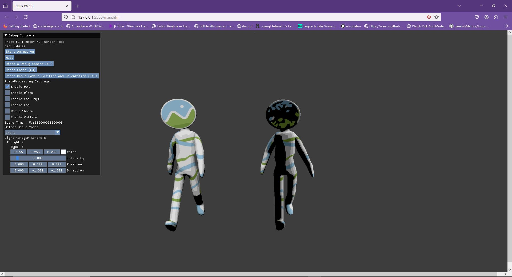

# Raster-WebGL-24
# WebGL Demo Engine

## Description

This is a simple yet powerful WebGL demo framework designed to help developers create stunning 3D graphics with ease. It includes a variety of useful features, ready-made effects, and a straightforward API.

## Features

- **3D Model Loading**: Supports 3D models with animation using Assimp.
- **BSpline Interpolator**: Smooth interpolations using Eigen.
- **Camera**: Includes both First Person and Spline-Based camera systems.
- **Light Manager**: Efficient light management.
- **Shadows**: Shadows rendering (PCF).
- **Timers**: Handy timing functions.
- **Deferred Shading**: GBuffer and separate Light pass.
- **Post Process Pipeline**: Customizable post-processing effects.
- **Scene Descriptor Class**: Easily manage and describe scenes.
- **UI**: Integrated UI using ImGUI.
- **Shader Management**: Efficiently manage and compile shaders.

## Premade Effects

- **Atmospheric Scattering**: Realistic atmospheric effects.
- **Grass**: Lifelike grass rendering.
- **Outline**: Procedural contour generation on meshes.
- **Procedural Water**: Dynamic water effects.
- **Vegetation**: Detailed vegetation rendering.
- **Cell Shading**: Cartoon-like shading effect.

## Screenshots

Here are some screenshots of the WebGL demo engine in action:

## Demo

Watch a demo of the WebGL engine in action on YouTube: [WebGL Demo Engine](https://youtu.be/uWI0NRxRAA8?si=I2muESUSUXXO4TVP)
